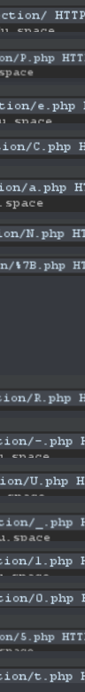

# PeCan CTF

## Shadow - Advanced Forensics

Personal Difficulty: 4/5

Personal Rating: ★★★★★

### TL;DR
Use impacket/examples/secretsdump.py to dump the password hashes from the NTDS.dit and SYS files that were provided. Use hashcat and rockyou.txt to crack the NTLM hashes for pparker

### What did I do?
 - I first saw the NTDS.dit file in the challenge and remembered to when I learned about Active Directory a while ago
 - The NTDS.dit file is a database that stores information for all users in that domain INCLUDING the NTLM hashes for each user
 - We can use impacket (a set of low level python classes for working with networking stuff) to dump the NTLM hashes from the NTDS.dit and SYS file we were provided with

```bash
sudo python3 /opt/impacket/examples/secretsdump.py -ntds ./ntds.dit -system ./SYS LOCAL -outputfile out.ntlm
```
 - Then we can use hashcat to crack the out.ntlm.ntds file that was dumped with impacket with the infamous rockyou.txt wordlist

```bash
hashcat -m 1000 -w 3 -a 0 --username pparker -o ./cracked.out --outfile-format=3 ./out.ntlm.ntds /usr/share/wordlists/rockyou.txt --potfile-path ./hashcat.pot
```
 - I don't think I saved the flag on the machine once I was done so I cannot show it here :/

## PHP Circus - Advanced Web Explotation

Personal Difficulty: 3/5

Personal Rating: ★★★★☆

### TL;DR

In the soure code, it checks if the md5 hash of the password is equal to "0". PHP has some problems in it's md5 hashing algorithm, thus causing the hash "0e462097431906509019562988736854" to equal "0". If you look up "php magic md5" you will find multiple hashes. If we enter "240610708" we get the flag `PeCaN{^&^Sh0ulD-HaV3_B33n-===\_n0T==}`

### What did I do?
 - When I first looked at the challenge, the first thing that I always do for webex is press Ctrl+U to view the source, this revealed nothing and I noticed there was a "See the source code" link.
 - In the source code:
```php
<?php
 require ("flagtoMD5.php");
 require("flag.php");
  
  //View PHP source code
  if (isset($_GET['source'])) {
    highlight_file(__FILE__);
    die();
  }

  //Match MD5
  if (isset($_GET['password']))
  {
    if (hash("md5", $_GET['password']) == "0")
    {
        getFlag();
    }
    else
    {
        echo "Sorry that is incorrect";
    }
  }  

?>
```
 - We can see that it gets the password parameter from the url, hashes it with md5 and checks if it is equal to "0"
 - If it equals "0" then it prints the flag, otherwise it will echo "Sorry that is incorrect"
 - I had already heard about the php magic hashes before but just for this writeup I looked up "php md5 hash 0" and it came up with [this](https://www.whitehatsec.com/blog/magic-hashes/) resource
 - It shows the hash that equals "0" and you will need to paste that into the password box to win!

## ABC Company - Intermediate Forensics

Personal Difficulty: 1/5

Personal Rating: ★★★☆☆

### TL;DR

Use wireshark to analyse the pcapng file, look at the telnet tcp stream and show only the requests which will reveal the flag `pecan{w0w_you_g0t_it}`

### What did I do?
 - In the challenge we are given a pcapng file to analyse and find the hidden flag
 - pcapng files are packet capture files exported from wireshark or another packet capture software
 - We can look through the packets manually to find each part of the packets, but wireshark can automatically display an entire packet conversation, or stream
 - The main packet stream we can see is a telnet stream, unencrypted, unencoded text that we can look at
 - If we right click on the packet, hover over "Follow" and click "TCP Stream" we are able to view the flag, but it is very messy and annoying to copy


 - What we can do is only view what the server sends back to the client
 - Once we do that, we will see the flag being put into a file called `flag1.txt` so we can assume it is the flag
```bash
                _                  _       _ _        _     _      ____  
 _ __ ___   ___| |_ __ _ ___ _ __ | | ___ (_) |_ __ _| |__ | | ___|___ \ 
| '_ ` _ \ / _ \ __/ _` / __| '_ \| |/ _ \| | __/ _` | '_ \| |/ _ \ __) |
| | | | | |  __/ || (_| \__ \ |_) | | (_) | | || (_| | |_) | |  __// __/ 
|_| |_| |_|\___|\__\__,_|___/ .__/|_|\___/|_|\__\__,_|_.__/|_|\___|_____|
                            |_|                                          


Warning: Never expose this VM to an untrusted network!

Contact: msfdev[at]metasploit.com

Login with msfadmin/msfadmin to get started


metasploitable login: msfadmin
Password: 
Last login: Sun Aug  8 01:46:51 EDT 2021 from 192.168.175.128 on pts/1
Linux metasploitable 2.6.24-16-server #1 SMP Thu Apr 10 13:58:00 UTC 2008 i686

The programs included with the Ubuntu system are free software;
the exact distribution terms for each program are described in the
individual files in /usr/share/doc/*/copyright.

Ubuntu comes with ABSOLUTELY NO WARRANTY, to the extent permitted by
applicable law.

To access official Ubuntu documentation, please visit:
http://help.ubuntu.com/
No mail.
msfadmin@metasploitable:~$ echo flag1{. .. .. .. .. .. .pecan{you_got. .. .0t-. ._the_First. .. .. .. .. .. .. .. .. .it_wow. .. .. ............wyou_g0t_it_...........oyou_g0t_it_...........wyou_g0t_it_..........._you_g0t_it_...........
.msfadmin@metasploitable:~$ echo pecan{wow_you_g0t_it_. .}..............w_you_g0t_it} ..............0w_you_g0t_it}.............
.msfadmin@metasploitable:~$ echo pecan{w0w_you_g0t_it} >> flag1.txt
msfadmin@metasploitable:~$ exit
```

## 3D Flag - Advanced Forensics

Personal Difficulty: -13428650980923/5

Personal Rating: ☆☆☆☆☆

### TL;DR
Open the file in Windows Paint 3D, painstakingly write down the flag written on the side of the pole, submit it.

### What did I do?
 - It gives us an STL file to find the flag in
 - STL stands for Standard Triangle Language or Standard Tessellation Language. These files store a bunch of vectors which tell a 3D program how to interpret it.
 - In windows by default we can double click the file to open it


 - When you open it you can see the flag on the side of the pole

## Redirection - Intermediate Web Exploitation

Personal Difficulty: 2/5

Personal Rating: ★★★★☆

### TL;DR
Use burp proxy to incercept the requests and copy down each character of the PHP files that it redirects you to

### What did I do?
 - We are given a page that says `Someone has given you directions to a flag with many dead ends involved, can you find your way to the flag?` and a button that says `Click here to begin`
 - When we click it, the page takes a long time to load. Based of the name I guessed that it was doing a lot of redirections. The path at the end was also `/challenges/Redirection/%7D.php`, %7D is a URL encoded } character so we can assume that it is the end of a flag and the pages that it redirects us to 
 - We can now open up burp suite and use FoxyProxy to redirect our traffic through burp
 - Now that we have all our requests proxied through burp, we can click the button and observe the requests



 - This reveals the flag `PeCan{R-U_l05t}`
